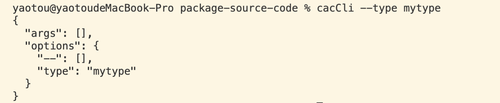
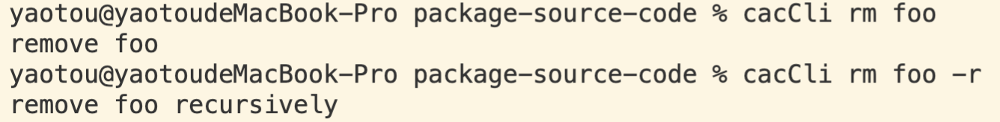

# cac

### 使用

- 基本使用

```js
const cli = require('cac')();
// 注册命令行默认参数
cli.option('--type <type>', 'Choose a project type', {
  default: 'node',
});

const parsed = cli.parse();
console.log(JSON.stringify(parsed, null, 2));
```



- 还可以注册子命令

```js
const cli = require('cac')();

cli
  .command('rm <dir>', 'Remove a dir')
  .option('-r, --recursive', 'Remove recursively')
  .action((dir, options) => {
    console.log('remove ' + dir + (options.recursive ? ' recursively' : ''));
  });
cli.help();
cli.parse();
```



### 查看源码

- 目录

```js
cac
├─ examples             // 示例
├─ scripts              //
├─ src                  // 项目开发目录
├─ .editorconfig        // 编辑器规范配置
├─ .gitattributes       // 文件规范
├─ .gitignore           // git 忽略文件
├─ .prettierrc          // prettier 格式化配置
├─ circle.yml           //
├─ index-compat.js      // 主入口, 兼容不同模块化
├─ jest.config.js       // jest 配置文件
├─ LICENSE              // 协议
├─ mod_test.ts          //
├─ mod.js               //
├─ mod.ts               //
├─ package.json         // 给npm看的文档
├─ README.md            // 给人看的文档
├─ rollup.config.js     // rollup 配置文件
├─ tsconfig.json        // ts 配置文件
└─ yarn.lock            // yarn 安装时 锁定包的版本
```

- src/CAC.ts

```ts
class CAC extends EventEmitter {
  name: string;
  commands: Command[];
  globalCommand: GlobalCommand;
  matchedCommand?: Command;
  matchedCommandName?: string;
  rawArgs: string[];
  args: ParsedArgv['args'];
  options: ParsedArgv['options'];
  showHelpOnExit?: boolean;
  showVersionOnExit?: boolean;
  constructor(name = '') {
    super();
    this.globalCommand = new GlobalCommand(this);
  }
  usage() {}
  command() {}
  option() {}
  help() {}
  version() {}
  example() {}
  outputHelp() {}
  outputVersion() {}
  private setParsedInfo() {}
  unsetMatchedCommand() {}
  parse() {}
  private mri() {}
  runMatchedCommand() {}
}
```
